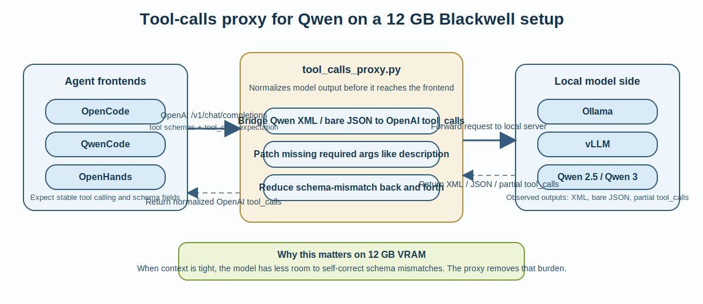
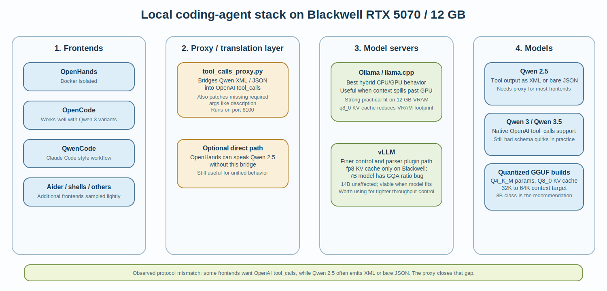

# Project Report: Local Coding Agent on Blackwell 5070 12 GB

This writeup captures the practical findings from setting up a local coding
agent that works well on an RTX 5070 Blackwell GPU with 12 GB VRAM.

The problem was not just "pick a model and run it". It was a fine balancing
act across model size, context length, KV cache size, quantization strategy,
tool-call format support, agent frontend behavior, and model-server behavior.

## Tool-Calls Proxy Illustration



## Stack Overview



## Goal

Setup a local coding agent that can work well on a Blackwell 5070 with 12 GB
VRAM.

## Challenges

This was a fine balancing act. The objective was to fit as much of the model
parameters, KV cache, and context into the GPU as possible to achieve realistic
speed, while still using as recent and as capable a model as possible so the
responses remained meaningful and useful.

There were many variables in the problem space:

- model size
- coding-agent frontend and version
- tool-calls infrastructure and version
- context length / embedding length
- parameter quantization
- KV-cache quantization
- model server

## Matrix of Findings

### Models

Qwen 2.5 supports XML format or JSON format for tool use.

Qwen 3 supports the OpenAI `tool_calls` API, but there were a few bugs in the
schema assumptions in Qwen 3.

Qwen 3 tool calls were missing the `description` argument, while some tools and
frontends treated that field as required in their schema handling. This was
later worked around with the tool-calls proxy in this repository.

There was also a `security_risk` argument case-sensitivity issue. OpenHands was
expecting one case and Qwen was using another. Thinking models, when given
sufficient context length, often recovered and corrected this on their own, but
that is not something to rely on when operating inside a tight VRAM budget.

Since there were already too many variables in play, Devstral, DeepSeek, and
GLM were only touched lightly. The primary focus stayed on Qwen, because it
started showing early promise.

### Quantization

For a 12 GB VRAM system, `Q4_K_M` parameter quantization helps keep the loaded
size smaller than the full model size at FP16 or FP32. `KV_CACHE_TYPE=Q8_0`
helps further reduce the loaded size.

TBD: experiment with 3-bit quantizations. That may require recreating GGUF
artifacts if the model does not natively ship with that encoding.

### Model Size

40B-class models are where the balancing problem gets much harder on a 12 GB
VRAM machine. Once realistic coding context length and KV cache are included,
the tradeoff becomes severe. The practical recommendation from this work is to
stay closer to the 8B range when the target is usable coding-agent behavior
rather than a narrow single-turn benchmark.

### Model Server

#### Ollama

Ollama showed impressive ability to split and load across CPU and GPU when the
model or context exceeded the GPU budget. `llama.cpp` is doing excellent work
here.

This matters a lot on a 12 GB setup because the system can still stay useful
even when everything does not fit perfectly on the GPU.

#### vLLM

vLLM gives finer control, but it does not have as mature a hybrid CPU/GPU load
path as Ollama / `llama.cpp` for this kind of constrained setup.

vLLM does support a tool-calls conversion plugin. That capability was the main
reason it was explored here, especially to try to get Qwen 2.5 working across
more favorite agent frontends.

The vLLM experiments ran into two blocking issues on this Blackwell setup:

1. Only the fp8 KV cache kernel compiled successfully on `sm_120a`. Non-fp8
   attention backends — including `VLLM_ATTENTION_BACKEND=TORCH_SDPA` — failed
   with a `cudaErrorUnsupportedPtxVersion` PTX compilation error.
2. The fp8 KV cache path produced garbled output with Qwen 2.5 7B due to its
   7:1 GQA ratio (28 query heads / 4 KV heads). The 14B variant (5:1 GQA)
   was unaffected.

These two issues combined blocked Qwen 2.5 7B on vLLM for this machine. The
pivot to Ollama followed from there. Since the recommended Qwen 3 8B class
model has a different architecture, vLLM remains worth revisiting once the
Blackwell fp8 kernel situation is better understood.

TBD: compare token throughput between vLLM and Ollama once vLLM is confirmed
stable on this Blackwell setup — the PTX and fp8 GQA issues need to be resolved
or worked around before a meaningful comparison is possible.

### Coding Agent Frontend

Many alternatives exist: Aider, OpenCode, OpenHands, QwenCode,
interactive-shell, and others.

After some initial sampling of each, the more extensive experiments focused on
OpenHands, QwenCode, and OpenCode.

#### OpenHands

Docker-isolated setup.

Natively supports the Qwen 2.5 tool-calling schema.

#### OpenCode and QwenCode

Both work off the shelf with Qwen 3 variants, but not with Qwen 2.5 unless a
bridge is added.

QwenCode is a clone from the Claude Code repository and has a similar look and
feel.

Both QwenCode and OpenCode have settings files where available model-server
endpoints can be configured:

- `~/.config/opencode/opencode.json`
- `~/.qwen/settings.json`

The configured models can then be selected from `/model` or `/models` commands
inside the frontend.

### Tool-Call API Support Issues

Qwen 2.5 prefers JSON-style tool output. Some tools also have a large tool
schema prompt. But Qwen 2.5 does not natively support the OpenAI `tool_calls`
API schema expected by several agent frontends.

OpenHands is able to work with Qwen 2.5 directly.

For the other frontends, this problem is now resolved with the new
`tool_calls_proxy.py` bridge in this repository. The proxy rewrites Qwen 2.5
XML / JSON tool-call output into OpenAI `tool_calls` format and also patches
minor schema mismatches such as missing required fields.

Some thinking models with sufficient context length corrected minor schema
mismatch issues on their own, but in this scenario the goal was to compress the
genie into a small box. The proxy helps avoid the extra back and forth.

### Context Length

A context length of at least 32K is required for meaningful coding tasks. 64K
is a better practical minimum.

Context length, KV cache, and model parameters all need to fit into the same
12 GB budget. That forces a real tradeoff.

The practical recommendation from these experiments is:

- around 8B parameters
- 64K context length when possible
- aggressive but still usable quantization

Observed runtime evidence from this setup:

```bash
((pyenv1)) ~/.qwen % ollama ps
NAME                   ID              SIZE      PROCESSOR    CONTEXT    UNTIL
qwen3-8b-64k:latest    1adc23451bf4    8.8 GB    100% GPU     40960      Forever
```

This is a concrete check that the recommended Qwen 3 8B configuration can sit
fully on the GPU on this Blackwell 5070 / 12 GB machine, with a practical
loaded context window of `40960` in that observed run.

## Practical Recommendation

For this Blackwell 5070 / 12 GB setup, the most practical direction is:

- Qwen 3 or Qwen 3.5 8B class model
- 64K context target if it still fits cleanly
- `Q4_K_M` parameter quantization
- `Q8_0` KV cache when available
- Ollama as the default server when CPU/GPU spillover flexibility matters
- vLLM as a viable option when the model fits and tighter control is useful
- `tool_calls_proxy.py` in front of agent frontends that expect OpenAI
  `tool_calls`

## Tips

- `ollama ps` shows the loaded size, context length, and CPU/GPU split.
- `ollama show <model-name>` shows more detailed model metadata.
- See [README.md](README.md), [INSTALL.md](INSTALL.md), and
  [README_local_qwen_setup.md](README_local_qwen_setup.md) for the repo setup
  instructions, full installation steps, Ollama server usage, and proxy-server steps.

## Future Work

- benchmark token throughput between Ollama and vLLM on this exact setup
- revisit FP8 kernel support on Blackwell for vLLM
- test whether 3-bit quantizations can extend context or model quality tradeoffs
- expand the comparison matrix beyond Qwen once the tool-call variables are more
  controlled

---

Tech Aarvam  
Copyright (c) 2026 Tech Aarvam.  
Author: Ram (Ramasubramanian B)  
AI assistants: Claude Code, Codex
